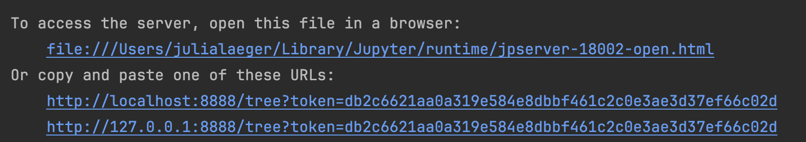
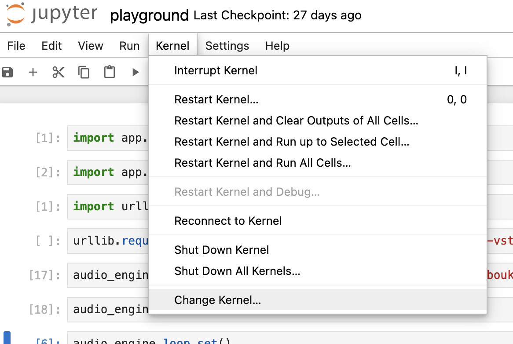
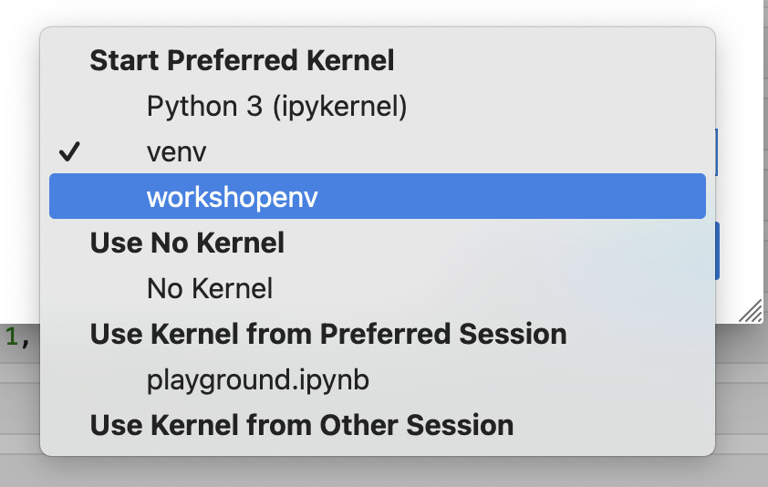
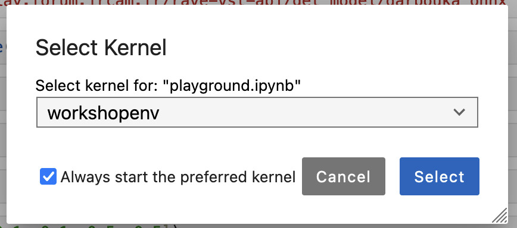
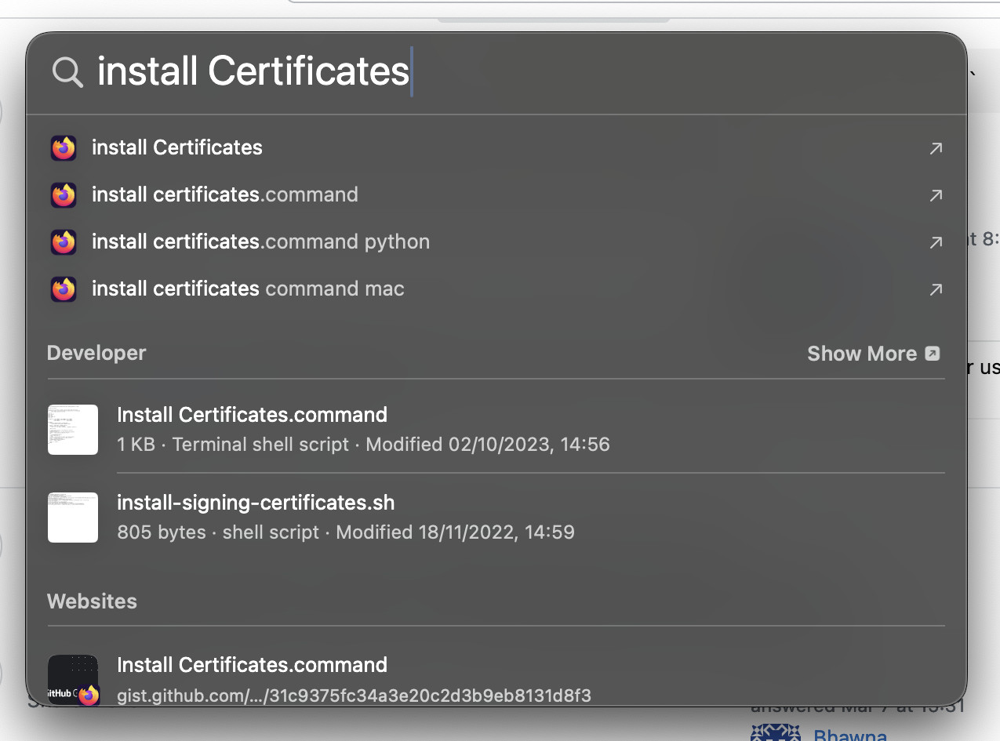

# Setting up the Playground
Get comfty on your command line for this set up. 

Please make sure you execute the right commands for your operating system.
Open a terminal window on Linux or Mac, or if you're on Windows search "cmd" on your searchbar which should show you the Command Prompt, ready to be double clicked.

## Setting up a local environment
We don't want to mess with your favourite personal python set up, so we'll create a local environment and activate it. On a Mac or Linux you can run:
```bash
python3 -m venv workshopenv
source workshopenv/bin/activate
```
TODO: add for windows

All the modules we need are defined in requirement.txt. You can install them like this after you activated your local environment
```bash
python3 -m pip install requirements.txt
```

## Prepare environment for jupyter notebook 

Now we have our environment with all modules. We need to run a couple more commands so we can select this later in jupyter notebook.
```bash
python3 -m pip install ipykernel
python3 -m ipykernel install --user --name=workshopenv
```

## Run jupyter notebook
Only one more thing to do on the command line to start up jupyter notebook. 
```bash
jupyter notebook
```

This will make a browser pop up showing a file index. Open playground.ipynb.
If the browser does not pop up automatically, you can click on the link in the command line output:


## Select Local Environment
To select our workshop environment in jupyter notebook you can follow these steps:
1. Select the Kernel dropdown

2. Click change Kernel and choose the new Kernel

3. Select it


Now you're ready to execute the code in the notebook.
...unless you are a...

## Mac User: 
### Install certificates so you can download the model file
Use the Spotlight search to find the file that executes the command. You can press command + space bar to open the search bar and start typing "Install Certificate.command"

You can double click on the entry, this will open a terminal and install the certificate needed to verify HTTPS connections.

Now you can execute the lines in the notebook and make some noise, yay.
If you still get issues downloading the file, you can download them directly, you can find the links in the [README.md](README.md).